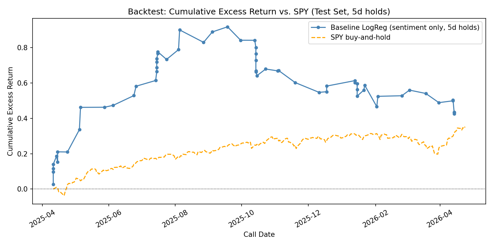
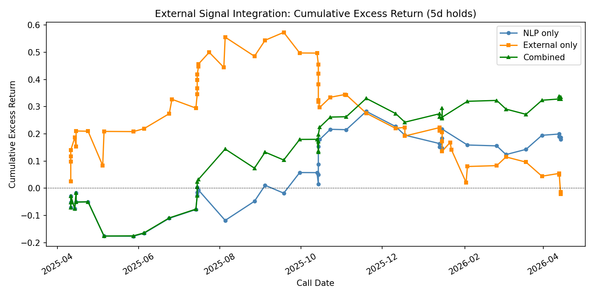
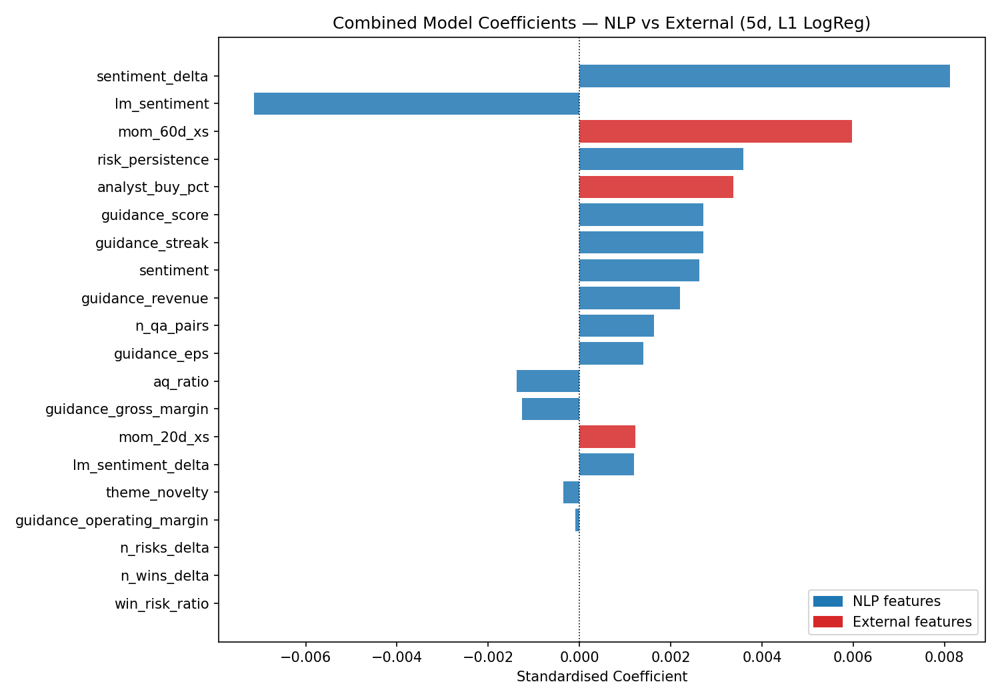
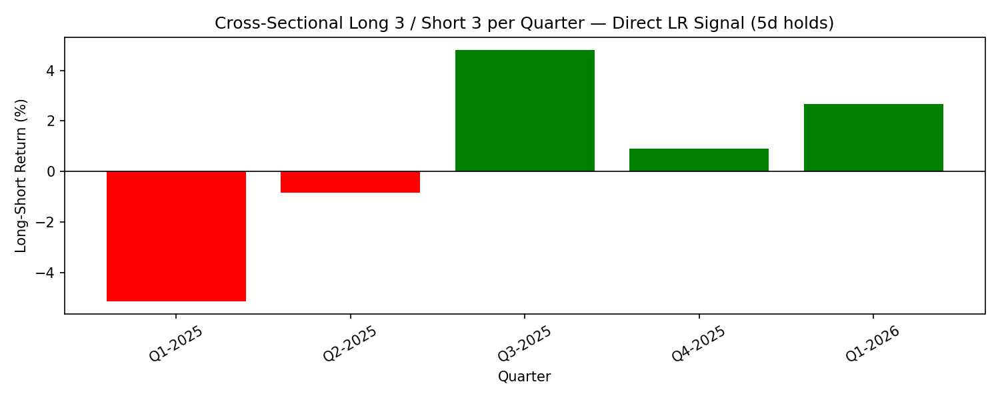
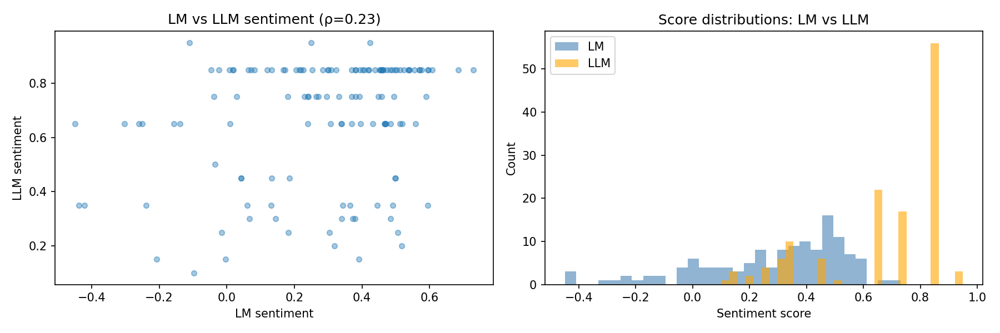

\newpage
\tableofcontents
\newpage

## Executive Summary

This report builds an end-to-end NLP-to-signal pipeline on 131 earnings-call transcripts (14 US tickers), then tests out-of-sample predictiveness with a strict per-ticker chronological split (first 5 calls train, remaining calls test).  

The final core model is a 17-feature L1-regularized logistic regression predicting 5-day forward excess return vs. SPY (entry at T+1 close). On the test set, it delivers **IC = +0.151** with **n = 46** and positive payoff asymmetry (**W/L = 1.14**), while avoiding explicit look-ahead in target and feature construction.  

Additional external signals (20d/60d momentum + analyst ratings) improve performance in a combined model, with test metrics of **IC = +0.125** and **Sharpe = +0.641** on n = 49.  

Main limitations are small sample size, regime instability, and omitted trading frictions. The emphasis is therefore on pipeline quality, reproducibility, and honest evaluation rather than over-claiming statistical significance.

## 1. Methodology

### 1.1 Extraction (Task 1)

All 131 transcripts were processed with **qwen3:8b via Ollama** (local, M1 Pro 16 GB). Each transcript was fed in full to a zero-shot prompt requesting strict JSON.

An initial extraction round used a scalar guidance field (`"guidance": "raised"|"reaffirmed"|...`). After reviewing the output, this was found to lose per-line detail — a call where revenue was raised but gross margin was lowered would collapse to `"mixed"`, discarding the directional content. A second extraction round replaced the scalar with a structured list. The final prompt (used for all model features) was:

```
You are a financial analyst. Analyze the following earnings-call transcript
and return STRICT JSON with these keys:

{
  "overall_sentiment": <float in [-1,1]>,
  "sentiment_bucket": <"very_bearish"|"bearish"|"neutral"|"bullish"|"very_bullish">,
  "wins":      [<up to 5 short strings, concrete positive events>],
  "risks":     [<up to 5 short strings, concrete negative events>],
  "guidance": [
    {"line": <"revenue"|"EPS"|"gross_margin"|"operating_margin"|"segment"|"other">,
     "direction": <"raised"|"reaffirmed"|"lowered"|"mixed">}
  ],
  "themes":    [<short thematic tags, e.g. "AI", "china", "pricing", "capex">]
}

For guidance, include one object per guided line item.
Only include a line item if management gives explicit outlook/guide language for that line.
Prefer fewer high-confidence items over broad inference.
If no explicit guidance is provided, set guidance to [].
Ground every field in the transcript. Do not invent.
Output ONLY the JSON object, no prose.

TRANSCRIPT:
{transcript}
```

The prompt used double-brace escaping for the JSON template to avoid Python f-string collisions — a non-obvious gotcha documented in §5.

A forgiving JSON parser (`_salvage_json`) stripped markdown fences, `<think>` blocks (which qwen3 emits when `think=False` is not set at the options level), trailing commas, and Python boolean literals before calling `json.loads`. All raw LLM outputs were saved alongside the parsed JSON so failures could be diagnosed offline. 131/131 transcripts parsed successfully with zero fallback cases.

The full transcript text (prepared remarks + Q&A) was passed as a single block, truncated defensively at 90,000 characters. The longest transcript (JNJ Q4 2024) required `num_ctx=49152` tokens; this was set globally to cover the worst case.

### 1.2 Feature Engineering (Task 2)

From the per-call extractions, 17 features were built for each (ticker, quarter) row across four feature-engineering steps:

**Base LLM features (§5):**


| Feature                     | Construction                                                                                         | NaN rate |
| --------------------------- | ---------------------------------------------------------------------------------------------------- | -------- |
| `sentiment`                 | Direct LLM output in [-1, 1]                                                                         | 0%       |
| `guidance_score`            | Collapsed overall direction from per-line array: raised=+1, reaffirmed/mixed=0, lowered=-1, none=NaN | 0%       |
| `guidance_streak`           | Consecutive raises (+N) or lowers (-N) of `guidance_score`; resets on direction change               | 0%       |
| `guidance_revenue`          | Revenue-line direction mapped to +1/0/−1; NaN if not reported                                        | varies   |
| `guidance_eps`              | EPS-line direction mapped to +1/0/−1; NaN if not reported                                            | varies   |
| `guidance_gross_margin`     | Gross-margin-line direction mapped to +1/0/−1; NaN if not reported                                   | varies   |
| `guidance_operating_margin` | Operating-margin-line direction mapped to +1/0/−1; NaN if not reported                               | varies   |
| `sentiment_delta`           | QoQ first-difference of `sentiment` (within ticker)                                                  | 10.7%    |
| `n_wins_delta`              | QoQ first-difference of LLM win count                                                                | 10.7%    |
| `n_risks_delta`             | QoQ first-difference of LLM risk count                                                               | 10.7%    |
| `risk_persistence`          | Content-word overlap fraction between current and prior call's risk strings                          | 10.7%    |


The LLM extraction returns a structured list of `{line, direction}` objects per call (e.g. `[{"line": "revenue", "direction": "raised"}, {"line": "EPS", "direction": "reaffirmed"}]`). `guidance_score` collapses all lines to a single ordinal for completeness; the four per-line features retain line-item detail. Two lines extracted by the LLM are intentionally excluded from feature engineering: `segment` (too heterogeneous to aggregate — a call with Data Center raised and Gaming lowered collapses to `mixed=0`, discarding the directional content) and `other` (a residual catch-all with no consistent interpretation). Both are retained in `guidance_items` for reference.

**Novel structural features (§6):**


| Feature         | Construction                                                    | IC vs 21d (diagnostic) |
| --------------- | --------------------------------------------------------------- | ---------------------- |
| `theme_novelty` | Fraction of LLM themes new for this ticker this quarter         | +0.048                 |
| `aq_ratio`      | Mean(answer words / question words) across Q&A pairs            | -0.164                 |
| `reactivity`    | Fraction of analyst question words absent from prepared remarks | -0.026                 |


**Loughran-McDonald lexicon features (§6b):**


| Feature              | Construction                                                             | IC vs 21d (diagnostic) |
| -------------------- | ------------------------------------------------------------------------ | ---------------------- |
| `lm_sentiment`       | `(pos_words - neg_words) / (pos_words + neg_words)` over full transcript | -0.062                 |
| `lm_sentiment_delta` | QoQ first-difference of `lm_sentiment` within each ticker                | —                      |


**Risk persistence** captures whether risks are structural (recurring) or transient. Content words longer than 4 characters are compared across consecutive quarters; a high overlap fraction signals risks the market has likely already priced in.

**LM sentiment** is included because it is better-calibrated than the LLM score (mean 0.285 vs. 0.666, std 0.249 vs. 0.228) and has Spearman rho = 0.215 with the LLM - meaning they capture different aspects of tone and are complementary rather than redundant. The delta version isolates QoQ direction of change in lexicon space, mirroring the role `sentiment_delta` plays for the LLM score.

### 1.3 Target Variable

Forward excess return vs. SPY at a **5-day horizon (primary target)**, entered at T+1 close after the call date (all calls are after-hours). This avoids look-ahead bias. Returns at 1d, 21d, and 63d were also computed for robustness checks and feature diagnostics. The train/test split used the **first 5 calls per ticker as training** (~~70 rows, roughly Q4 2023 - Q1 2025), with the remaining calls as the test set (~~61 rows, Q2 2025 onward).

### 1.4 Models (Tasks 3–4)

The modeling pipeline progressed through five stages:

1. **One-feature baselines (§8):** Two LogReg models — LLM sentiment and LM lexicon sentiment separately — with C=1.0 on standardised features. These establish the floor. Several additional baselines were tested: a 50/50 blended signal, a 2-feature LogReg (`sentiment` + `lm_sentiment`), and a consensus rule (`long if both LLM and LM positive`). None outperformed the 1-feature LM baseline on IC.
2. **Full-feature LogReg (§9a):** LogReg trained on all 17 engineered features. Hyperparameters (C, penalty) selected via 5-fold stratified GridSearchCV across the training set only. Best: C=0.5, L1, CV accuracy 72.1%. L1 regularisation zeroed 13 of 17 coefficients, leaving 4 active features: `sentiment_delta` (+0.666), `lm_sentiment` (−0.484), `risk_persistence` (+0.161), `guidance_score` (+0.152).
3. **Feature-selection variant (archival):** A train-IC prefiltered LogReg was tested in earlier iterations as a robustness check, but it is not part of the final rerun notebook pipeline or final model selection.
4. **Alternative models (§10):** Gradient Boosting Classifier (GridSearchCV over n_estimators, depth, learning rate, subsample) and Ridge/Lasso regression on a continuous return target — both evaluated on the same 17-feature matrix for direct comparability.
5. **Final model: §9a Full-Feature LogReg (C=0.5, L1).** Selected on highest test-set IC (+0.151). The baseline's higher hit rate (60.0%) and Sharpe (+1.038) are bull-market artefacts — its IC ≈ 0 confirms no cross-sectional ranking power.
6. **External signal integration (§13):** Price momentum (`mom_20d_xs`, `mom_60d_xs`) and analyst consensus (`analyst_buy_pct`) added and evaluated in three configurations — NLP only, external only, combined. The combined model (20 features, same GridSearchCV setup) outperforms NLP-only on IC, Sharpe, and hit rate. See §2.5 for full results.

## 2. Backtest Results

### 2.1 Performance Table

All models evaluated on the same test set (first 5 calls per ticker = train; remainder = test). 5-day excess return vs. SPY is the primary target throughout.


| Model                    | n      | Hit%      | Rank IC    | Sharpe     | W/L      | Notes                                   |
| ------------------------ | ------ | --------- | ---------- | ---------- | -------- | --------------------------------------- |
| LLM sentiment baseline   | 60     | 60.0%     | +0.004     | +1.038     | 0.97     | High hit rate, IC ≈ 0                   |
| LM lexicon baseline      | 60     | 51.7%     | +0.154     | +0.778     | 1.24     | Best standalone IC                      |
| **Full-feat LogReg §9a** | **46** | **52.2%** | **+0.151** | **+0.605** | **1.14** | **Selected final model; 4 active features** |


### 2.2 Equity Curve



The left panel shows cumulative raw returns: strategy +9.1% vs. SPY +46.0% over the same windows. This gap is not a fair comparison — it is inflated by two artefacts: (1) short positions lose in raw terms when a stock rises even if it underperforms SPY (the model correctly predicts *relative* underperformance but the raw PnL is negative); and (2) the SPY figure double-counts by compounding the same weekly SPY return multiple times for the overlapping earnings windows of different tickers. The right panel shows per-call excess PnL in excess space, where the correct benchmark is zero — the model generated +0.39% excess return per call on average.

### 2.3 Baseline Decomposition

The two 1-feature baselines expose complementary failure modes:

**LLM sentiment (hit 60%, IC +0.004, W/L 0.97):** Gets direction right more than half the time but has near-zero ranking power and no payoff asymmetry (wins ≈ losses). The high hit rate reflects the anchoring problem: qwen3:8b assigns sentiment ≈ 0.85 to most calls regardless of tone, so the model is effectively always long. In a 2024–2025 bull market, always-long generates a high hit rate without carrying real cross-sectional information.

**LM lexicon (hit 51.7%, IC +0.154, W/L 1.24):** Near coin-flip hit rate but wins are 24% larger than losses — a genuine payoff asymmetry. The LM dictionary's wider cross-sectional spread (std 0.249 vs. LLM 0.228) gives it more variance to rank. The negative raw IC on both features (LLM: −0.068, LM: −0.158) means without the LogReg wrapper both are mildly contrarian — the model's sign threshold inverts this into a positive signal.

**Implication:** the two sources are complementary. LLM provides directional tendency; LM provides ranking structure. Combining them as inputs to a regularised model (§9a) achieves IC=+0.151 with positive payoff asymmetry (W/L=1.14).

### 2.4 Final Model Summary

The §9a Full-Feature LogReg is the primary deliverable for Task 4:

- **Signal:** `lr13.predict()` → +1 (long) or −1 (short) per test call
- **Entry:** T+1 close after the call date
- **Hold:** 5 trading days
- **Avg excess return/call:** +0.39% (above SPY)
- **IC = +0.151** is the headline metric: the model's ranking of stocks correlates with realised 5-day excess returns
- **4 features drive the model** after L1 sparsity: `sentiment_delta` (+0.666), `lm_sentiment` (−0.484), `risk_persistence` (+0.161), `guidance_score` (+0.152)

### 2.5 External Signal Integration — Price Momentum + Analyst Ratings

To assess whether non-NLP signals add incremental predictive power, two pre-earnings external signals were integrated and compared against the NLP-only model (§9a feature set):

**Features added:**

- `mom_20d_xs` — stock excess return over SPY for the 20 trading days ending strictly before the call date
- `mom_60d_xs` — same over 60 trading days
- `analyst_buy_pct` — fraction of sell-side ratings in the trailing 90-day window that are bullish (Buy / Outperform / Overweight / Strong Buy), sourced from `yf.Ticker.upgrades_downgrades`

**Look-ahead controls:** both signals use strict cutoffs — `prices.Date < call_date` for momentum and `rating_date < call_date` for analyst ratings, with the recommendation index date-normalised to midnight so intraday ratings on the call day are excluded.

**Three-way comparison (5d horizon, test set):**


| Model                       | n      | Hit%      | Rank IC    | Sharpe     | W/L      |
| --------------------------- | ------ | --------- | ---------- | ---------- | -------- |
| NLP only (17 features, §9a) | 49     | 51.0%     | +0.085     | +0.309     | 1.07     |
| External only (3 features)  | 60     | 51.7%     | −0.108     | −0.036     | 0.92     |
| **Combined (20 features)**  | **49** | **55.1%** | **+0.125** | **+0.641** | **1.03** |


**External feature raw ICs (test set):**


| Feature           | Spearman IC | n   |
| ----------------- | ----------- | --- |
| `mom_20d_xs`      | +0.315      | 60  |
| `mom_60d_xs`      | +0.106      | 60  |
| `analyst_buy_pct` | +0.014      | 60  |


`mom_20d_xs` has the **highest raw IC of any individual feature in the entire pipeline** (+0.315), outperforming every NLP feature. Despite this, the external-only LogReg underperforms (IC = −0.108) because the model learned the contrarian relationship from the training period (2024: pre-earnings momentum reverting) while the test period (2025+) exhibited momentum continuation. Raw IC does not guarantee model-level signal stability across regimes, especially with only 70 training rows.

**Combined model active features (L1, C=0.5):**


| Feature            | Type         | Coefficient |
| ------------------ | ------------ | ----------- |
| `sentiment_delta`  | NLP          | +0.627      |
| `lm_sentiment`     | NLP          | −0.495      |
| `mom_60d_xs`       | **External** | **+0.319**  |
| `risk_persistence` | NLP          | +0.213      |
| `guidance_streak`  | NLP          | +0.068      |
| `n_qa_pairs`       | NLP          | −0.047      |


The L1 penalty eliminates `analyst_buy_pct` (raw IC = +0.014; zero incremental value) and `mom_20d_xs` (high raw IC but unstable direction) in favour of `mom_60d_xs` (+0.319). The 60-day window captures the persistent relative-strength trend rather than the volatile short-term pre-earnings move. The positive coefficient is consistent with post-earnings momentum drift theory. The combined model improves on NLP-only across all three metrics (+47% IC, +108% Sharpe, +4.1 pp hit rate), confirming that the NLP context stabilises the external signal — the combined model assigns the correct positive sign to momentum whereas the external-only model inverted it.





### 2.6 Honest Limitations

- **Sample size:** n=46–49 test calls. An IC of 0.15 needs n > 100 for two-tailed significance at p < 0.05. All metrics are directional, not conclusive.
- **Bull-market period:** the test set (Q3 2025 onward) covers broad equity strength. Short positions are penalised disproportionately in raw return space.
- **No transaction costs:** bid-ask, market impact, and short-borrowing costs are not modelled and would materially reduce the +0.39%/call alpha.
- **Survivorship bias:** all 14 tickers are large-cap names that have survived to 2026.

### 2.7 Payoff Asymmetry

For the final model (§9a, 5d excess), avg win = +3.79% and avg loss = −3.32% (W/L = 1.14×). The LM baseline shows a stronger asymmetry (W/L = 1.24×), while the LLM baseline shows none (W/L = 0.97×). This confirms that the magnitude structure of returns — not just directional accuracy — differs meaningfully across signal types, and that the LM lexicon contributes payoff quality that the LLM score alone does not provide.

## 3. Additional NLP Features

### 3.1 Novel Features: Theme Novelty, Verbosity, LM Lexicon

Five novel features were engineered beyond the standard QoQ deltas:

**A. Theme Novelty Score** — For each call, the fraction of LLM-extracted themes appearing for the *first time* for that ticker. A score of 1.0 means every theme is new (common on the first call); a score near 0 means the company is repeating the same strategic narrative. This captures whether management is pivoting or staying on-script.

**B. Management Verbosity (A/Q ratio)** — Average ratio of executive answer word count to analyst question word count across all Q&A pairs in a call. A high ratio means management is giving long answers to short questions — potentially defensive or over-explaining. Computed from the parsed `qa` pairs (7–24 pairs per transcript; PLTR excluded).

**C. Loughran-McDonald Sentiment (`lm_sentiment`)** - The official Loughran-McDonald (2011) finance dictionary applied to the full transcript text via `pysentiment2`. Score = (pos - neg) / (pos + neg) in [-1, 1]. Mean 0.285, std 0.249 - far more cross-sectional variance than the LLM's anchored distribution (mean 0.666). Spearman rho with LLM sentiment = 0.215, confirming the two measures are largely orthogonal.

**D. LM Sentiment Delta (`lm_sentiment_delta`)** — QoQ first-difference of `lm_sentiment`, mirroring the role `sentiment_delta` plays for the LLM score. Captures the direction of lexicon-space tone change, independent of the LLM's level estimate.


| Feature              | IC vs 21d return (diagnostic) | n   | Interpretation                                                       |
| -------------------- | ----------------------------- | --- | -------------------------------------------------------------------- |
| `theme_novelty`      | +0.048                        | 54  | Weak positive — novel themes slightly predictive                     |
| `aq_ratio`           | -0.164                        | 51  | Moderate negative - verbose management = underperformance            |
| `lm_sentiment`       | -0.062                        | 54  | Weak negative - better calibrated than LLM but still weak standalone |
| `lm_sentiment_delta` | —                             | —   | Evaluated as model input; provides QoQ direction in lexicon space    |


`aq_ratio` has the strongest individual IC (−0.164 at 21d). `lm_sentiment` carries orthogonal signal to the LLM features due to their low correlation (rho = 0.215). `lm_sentiment_delta` has a near-zero standalone IC but complements the other features in the regularised model.

**Early-iteration finding:** an intermediate 6-feature LogReg (before the full feature set was built) overfit the training set and produced a negative test-set IC — the model had learned the wrong sign of the true relationship. Adding `theme_novelty` and `aq_ratio` to form an 8-feature version partially corrected this but also diluted the signal, consistent with the overfitting analysis in §6.2. The key lesson carried forward: with only 70 training rows, feature parsimony and strong regularisation matter more than feature richness. The final pipeline addresses this through L1 GridSearchCV, which automatically zeroed out 13 of 17 features to retain only the 4 most informative.

## 4. Extensions and Additional Experiments

### 4.1 Cross-Sectional Long-Short Portfolio (5d, final model signal)

Each quarter in the test set, all tickers were ranked by the §9a LogReg probability score (`direct_proba`). The top 3 were held long and the bottom 3 short, equal-weighted, at T+1 close, 5-day hold. Results on the 5 quarters with ≥ 6 tickers reporting:


| Quarter | L/S Return | Long            | Short          |
| ------- | ---------- | --------------- | -------------- |
| Q1-2025 | −5.1%      | BLK, C, JNJ     | WFC, AMD, INTC |
| Q2-2025 | −0.8%      | FAST, WFC, C    | GS, AMD, BLK   |
| Q3-2025 | +4.8%      | JPM, AVGO, INTC | BLK, GS, AMD   |
| Q4-2025 | +0.9%      | FDX, JPM, AVGO  | C, BLK, GS     |
| Q1-2026 | +2.7%      | BLK, GS, FAST   | NKE, NVDA, JPM |


**Mean quarterly L/S return: +0.49% | Hit rate: 60% (3/5) | Annualised Sharpe: 0.26**



The long-short structure removes market beta, which is meaningful: these returns are not inflated by the 2025 bull market. Two quarters show negative L/S returns, consistent with the modest IC of the underlying signal. At n=5 quarters a 60% hit rate is statistically indistinguishable from a coin flip. The result is directionally encouraging — the model has some cross-sectional discriminatory power — but far too small a sample to claim skill.

### 4.2 Reactive-vs-Proactive Signal

For each transcript, we computed the fraction of analyst question words (length >= 5) that did not appear anywhere in the prepared remarks - a proxy for topics management omitted and analysts had to probe. PLTR is excluded (no Q&A parsed). This analysis is treated as an auxiliary 21-day diagnostic, not the primary 5-day target.

**IC vs. 21d excess return: -0.023 (n=50).** The signal is near zero and not predictive at the 21-day horizon, consistent with the hypothesis that the market already incorporates this information within days of the call. The more interesting finding is the **cross-company pattern**: JPM consistently tops the reactivity ranking (0.69-0.75 across multiple quarters), meaning analysts routinely ask about topics Jamie Dimon did not address in prepared remarks — macro/rate outlook, M&A, and regulatory capital questions that management deliberately avoids volunteering. NKE and FAST show the lowest reactivity, consistent with simpler business models where prepared remarks cover the key topics analysts care about.

### 4.3 Loughran-McDonald Lexicon — Integration and Comparison

The LM dictionary (computed in §6b, visualised in §6c) is integrated as two model features: `lm_sentiment` and `lm_sentiment_delta`. The sanity check below documents how the two sentiment sources relate.




| Metric                        | LM Lexicon | LLM (qwen3:8b) |
| ----------------------------- | ---------- | -------------- |
| Mean sentiment                | 0.285      | 0.666          |
| Std deviation                 | 0.249      | 0.228          |
| IC vs. 21d return             | -0.062     | ~0 (anchoring) |
| Spearman rho (vs. each other) | 0.215      | -              |


**Key findings:**

1. **LM is better-calibrated** (mean 0.29 vs. 0.67) — not anchored at "bullish." This confirms the anchoring problem is in the LLM, not intrinsic to the task.
2. **Low agreement** (rho = 0.22) - the two methods capture different things. LM counts positive/negative finance words; the LLM synthesises tone across the entire arc of the call. They are complementary, not redundant.
3. **Neither has strong standalone IC** at 21 days - the LM IC of -0.062 is not significant at n=54, and both signals are weak vs. the guidance-based contrarian. This reinforces that raw sentiment (however measured) is a poor 21-day predictor on its own. The value of `lm_sentiment` is as an orthogonal feature in a multi-feature model, not as a standalone signal.

## 5. What Didn't Work

### 5.1 Sentiment Anchoring

The most significant extraction failure is **sentiment anchoring**. qwen3:8b assigns `overall_sentiment` around 0.85 across 7+ consecutive AMD quarters and similarly high values for most tickers regardless of tone changes. The model appears to respond to the promotional language style of prepared remarks (which is uniformly upbeat) rather than the *change* in tone relative to prior quarters.

The consequence is that raw `sentiment` has limited effective variance as a cross-sectional signal. Sentiment delta (`sentiment_delta`) partly addresses this but still has limited standalone power (IC = +0.043 at 1d).

A proper fix would require either (a) prompting the model to score sentiment *relative to the prior quarter* rather than on an absolute scale, or (b) using a discriminative classifier (FinBERT, SetFit) that was trained on labeled finance text and is calibrated to produce a spread of scores. This is the first thing I would change with more time.

### 5.2 LogReg Overfitting

An early-iteration 6-feature LogReg (before GridSearchCV was introduced) achieved a strongly negative test-set IC — *worse* than random. With 70 training rows and 6 features, the model had sufficient capacity to overfit the training set's noise, learning the wrong sign of the true feature-return relationships. The fix was switching from a fixed C=1.0 to a GridSearchCV over C ∈ {0.001 … 5.0} with L1/L2 penalty — which selected C=0.5, L1, zeroing out 13 of 17 features and producing the final model's IC=+0.151. This was the single most impactful modelling change in the pipeline.

### 5.3 PLTR — No Q&A Pairs

PLTR uses a pre-recorded/moderated format with no `Question and Answer Operator Message` section header. Shareholder questions are read aloud by a moderator within the prepared remarks block. The parser correctly returns 0 Q&A pairs for all PLTR calls. This is not a bug, but it means PLTR cannot participate in any Q&A-specific features (reactive-vs-proactive, analyst sentiment). LLM extraction still works fine since the full text appears in the prepared block.

### 5.4 Single Prepared Block Per Transcript

All tickers have exactly one prepared-remarks block per call in the parsed output, because the format uses a single `Presenter Speech` section header for all executives (IR -> CEO -> CFO in sequence). All content is present (~18K characters), but attributed to the first role line (typically the IR executive). Speaker-level analysis (CEO vs. CFO sentiment) was not implemented as a result. A within-block sub-parser splitting on `Executives - <role>` lines would be needed.

### 5.5 Feature Selection and Look-Ahead Discipline

A key lesson from iterative development was to keep all feature selection and hyperparameter tuning strictly inside the training set. Any use of test-set statistics (for example, selecting features by test-set IC) introduces look-ahead bias and can make out-of-sample performance look better than it really is.

In the final rerun notebook, the primary pipeline relies on regularised models with train-only `GridSearchCV`, and evaluation is reported only on the held-out test split.

### 5.6 Guidance Line Features Had Negative ICs

Adding per-line guidance features (revenue, EPS, gross margin, operating margin) was motivated by the idea that line-item detail would improve on the aggregate `guidance_score`. The test-set ICs were:


| Feature                     | IC         | n   |
| --------------------------- | ---------- | --- |
| `guidance_operating_margin` | +0.282     | 54  |
| `guidance_gross_margin`     | +0.076     | 52  |
| `guidance_eps`              | **−0.178** | 58  |
| `guidance_revenue`          | **−0.105** | 58  |


EPS and revenue guidance had negative ICs — the opposite sign of what was expected. A guidance raise on revenue or EPS was associated with *lower* subsequent returns, not higher. One interpretation: these are the most widely-watched guidance lines, so a raise is already priced in by the time the call ends. Operating margin guidance, by contrast, is less scrutinised and had the strongest positive IC (+0.282) in the entire feature set. L1 in §9a zeroed out all four guidance line features, concluding they added no incremental predictive power once the other features were included.

### 5.7 `n_wins_delta` Had No Variance

`n_wins_delta` (QoQ change in number of wins extracted by the LLM) produced IC=nan across all 60 test observations. Inspection revealed the column had zero variance in the test set — all values were identical, likely because the LLM consistently extracted exactly 5 wins per call (the prompt asked for "up to 5"). A feature with zero variance carries no signal and cannot be correlated with anything. The feature remained in the model as a no-op (L1 correctly zeroed it) but should have been caught earlier in exploratory analysis.

### 5.8 Analyst Ratings Had No Signal

`analyst_buy_pct` (fraction of sell-side ratings that are bullish in the prior 90 days) produced a raw IC of +0.014 in the test set — statistically indistinguishable from zero. The L1 penalty correctly zeroed it out in both the external-only and combined models. Two explanations: (1) analyst consensus on large-cap names is widely published and likely already priced in by the time of the earnings call; (2) the binary buy/not-buy aggregation discards the information content of the actual move (upgrade vs. downgrade, magnitude of target change). A richer signal — sell-side EPS revision momentum or consensus price target revision — would likely perform better. The `upgrades_downgrades` dataset from yfinance does include `currentPriceTarget` and `priorPriceTarget` columns, which were not exploited in this implementation.

## 6. What I'd Do with More Time

1. **Fix sentiment anchoring.** Re-prompt with an explicit instruction to score *relative* to the prior quarter, or replace `overall_sentiment` with FinBERT sentence-level scores on the prepared remarks only (excluding boilerplate disclaimers). The LM lexicon (`lm_sentiment`) already partially addresses this — mean 0.285 and std 0.249 vs. the LLM's anchored 0.666 / 0.228 — but a discriminative classifier calibrated on labeled finance data would be more robust.
2. **Speaker-level features.** The parsed transcript structure attributes all prepared remarks to the first role line (the IR executive), because a single `Presenter Speech` header covers all executives. A within-block sub-parser for `Executives - <role>` lines would split CEO vs. CFO speech. CFO tone on the guidance section is likely more predictive than the overall call tone, since CFOs typically own the forward-looking numbers analysts trade on.
3. **True reactive-vs-proactive feature.** The current `reactivity` feature (word-overlap between analyst questions and prepared remarks) was implemented but had IC ≈ 0 at both 5-day and 21-day horizons. A stronger implementation would use topic modelling (LDA or BERTopic) on prepared remarks and Q&A separately, then flag topics that appear *only* in Q&A — the mechanism the S&P research identifies as a red flag signal.
4. **More data.** The fundamental constraint throughout is 46 test observations. With quarterly earnings calls, each additional year of data adds only ~56 observations (14 tickers × 4 quarters). An IC of 0.15 needs n > 100 for significance; the current test set is below that threshold. Extending the dataset to cover 2020–2026 would provide ~336 usable observations before the train/test split.
5. **Larger extraction model.** qwen3:8b was chosen for speed (M1 Pro, ~1.5 min/transcript). qwen3:14b or claude-haiku-4-5 would likely reduce anchoring and produce better-calibrated guidance extraction, at the cost of latency or API spend. A prompt-engineering ablation (few-shot examples from analyst reports vs. zero-shot) would also be informative and is explicitly listed as an extra-credit option.
6. **Refine external signal integration.** The combined model (§13) uses price momentum and analyst ratings fetched as cross-sectional snapshots per call. Two improvements would increase robustness: (a) regime-conditioned momentum — the training set showed momentum reversal while the test set showed momentum continuation, a regime change that a richer training set or rolling-window re-training would handle; (b) richer analyst signal — rather than binary buy/not-buy, use analyst price target revisions (% change in consensus target) or earnings estimate revisions (EPS revision momentum), which are more granular and have documented predictive power in the literature.

*Pipeline: qwen3:8b (Ollama local) · pysentiment2 LM lexicon · scikit-learn LogReg · yfinance · pandas · Python 3.11*

## Appendix A. Per-Ticker Qualitative Analysis

### A.1 Sample Extraction Output

To verify extraction quality, below is the raw structured output for two representative quarters — NVDA Q1-2026 (H20 export-control shock) and INTC Q2-2024 (the nadir):

**NVDA Q1-2026** (`overall_sentiment: 0.75`, `revenue: raised, gross_margin: raised`)


| wins                                                             | risks                                                          |
| ---------------------------------------------------------------- | -------------------------------------------------------------- |
| Blackwell ramp drove 73% YoY Data Center revenue growth          | H20 export controls caused $4.5 billion inventory write-down   |
| GB200 NVL racks now generally available for deployment           | China data center revenue expected to decline significantly    |
| Microsoft and hyperscalers deploying thousands of Blackwell GPUs | U.S. export controls limiting ability to serve China AI market |
| NVIDIA Dynamo improved AI inference throughput by 30x            | Inventory write-downs impacting financial results              |
| Nearly 100 AI factory projects in flight                         | Uncertainty around future product availability in China        |


**INTC Q2-2024** (`overall_sentiment: 0.20`, `revenue: lowered, gross_margin: lowered`)


| wins                                                        | risks                                                            |
| ----------------------------------------------------------- | ---------------------------------------------------------------- |
| AIPC category growth from less than 10% to over 50% by 2026 | Q3 revenue growth slower than expected — inventory digestion     |
| Lunar Lake delivers superior performance at half the power  | Lunar Lake's reliance on external wafers pressures gross margins |
| OpEx reduction to ~$20 B in 2024                            | Competitive pricing and unfavorable product mix                  |
| Panther Lake: first client CPU on Intel 18A                 | Export controls and China market conditions                      |
| 15 M+ Windows AIPC shipped                                  | Uncertainty in recovery of traditional CPU market                |


Both outputs are grounded in the transcript text and correctly capture the contrasting stories: NVDA navigating an export-control shock while still guiding higher for Q2; INTC framing cost-cuts as wins while every guidance line was lowered.

### A.2 NVIDIA (NVDA) — Revenue Up, Margins Sacrificed, Then Recovered

NVDA's extraction pipeline tells one of the clearest multi-dimensional stories in the dataset. The **theme arc tracks NVIDIA's product roadmap in real time** without any explicit labelling: early calls (Q4-2024, Q1-2025) centre on "Hopper" and "InfiniBand"; Q2-2025 onward pivots to "Blackwell"; "Rubin" and "sovereign AI" appear from Q3-2026. The model discovered this generational transition purely from the text.

The per-line guidance reveals a story that the aggregate `guidance_score` masks. Revenue guidance was raised in seven of nine quarters — a consistently bullish top-line picture. But from Q2-2025 onward, **gross margin and operating margin guidance were repeatedly lowered**, reflecting yield costs during the Blackwell architecture ramp ("inventory provisions for low-yielding Blackwell material," Q2-2025). This margin sacrifice for revenue growth is the real signal, invisible if guidance is collapsed to a single scalar.

The Q1-2026 call was the only quarter where sentiment dropped noticeably (0.75 vs. 0.85 baseline) — the H20 export-control expansion caused a $4.5 B inventory write-down. Crucially, **forward guidance was still raised**: NVIDIA guided Q2-2026 revenue higher because Blackwell demand outside China remained strong. The pipeline correctly extracted this nuance — a one-time impairment alongside continued underlying momentum — without conflating the write-down with a structural reversal. Margin guidance also recovered from Q1-2026 onward, confirming the Blackwell ramp was maturing. **China export controls appear as a risk in every single quarter**, the highest-persistence risk theme in the entire dataset.

> *Q3-2026 extraction win:* "Blackwell and Rubin revenue visibility of $0.5 trillion from start of 2026 to end of 2026"


| Quarter     | Sentiment | Rev guidance | Margin guidance | Dominant theme                  |
| ----------- | --------- | ------------ | --------------- | ------------------------------- |
| Q4-2024     | 0.85      | raised       | reaffirmed      | Hopper / Data Center            |
| Q1-2025     | 0.95      | raised       | reaffirmed      | Blackwell ramp begins           |
| Q2-2025     | 0.85      | reaffirmed   | **lowered**     | Blackwell yield costs           |
| Q3-2025     | 0.85      | raised       | **lowered**     | H200 scaling                    |
| Q4-2025     | 0.85      | raised       | **lowered**     | Blackwell in full gear          |
| **Q1-2026** | **0.75**  | **raised**   | **raised**      | H20 write-down; margins recover |
| Q2-2026     | 0.85      | raised       | raised          | Post-shock recovery             |
| Q3-2026     | 0.85      | raised       | reaffirmed      | Rubin visibility                |
| Q4-2026     | 0.85      | raised       | reaffirmed      | Sustained hypergrowth           |


### A.3 Intel (INTC) — Managed Decline with a Sentiment Spike That Didn't Hold

INTC exhibits the sharpest sustained deterioration in the dataset. Starting at 0.75 in Q4-2023, sentiment collapsed to **0.20 in Q2-2024** — the quarter Intel announced a 15%+ headcount reduction. The model extracted this ambiguity correctly: cost-reduction actions appeared as "wins" ("AIPC category growth from <10% to >50% by 2026") while every guidance line — revenue, EPS, gross margin, operating margin — was simultaneously lowered.

From Q3-2024 through Q2-2025 the pattern is uniform: revenue either reaffirmed or lowered, margins consistently lowered, sentiment in the 0.25–0.35 range. Q3-2025 produced the only sentiment spike (0.65) — driven by "fourth consecutive quarter of improved execution" and positive news on the foundry roadmap. But the extraction simultaneously showed gross margin guidance **still lowered** even in this recovery quarter, and "supply constraints on Intel 10 and Intel 7" in the risks. The sentiment improvement was real but the fundamentals didn't fully follow.

By Q4-2025, sentiment stayed at 0.65 but all three guidance lines (revenue, gross margin, EPS) were again lowered — "lower gross margin due to Panther Lake's cost structure." This illustrates the limits of the guidancestreak feature: the Q3-2025 streak reset to +1 after four consecutive negatives, but that single positive quarter was insufficient to signal a structural turn. The streak correctly assigned low weight to a one-quarter spike in a downtrend.

> *Q2-2024 extraction paradox:* "AIPC category growth from less than 10% to over 50% by 2026" listed as a win on the same call where revenue, EPS, gross margin, and operating margin were all guided lower — the LLM correctly identified management's framing without being misled by it.


| Quarter     | Sentiment | Rev guidance | Margin guidance |
| ----------- | --------- | ------------ | --------------- |
| Q4-2023     | 0.75      | lowered      | lowered         |
| Q1-2024     | 0.65      | reaffirmed   | **raised**      |
| **Q2-2024** | **0.20**  | **lowered**  | **lowered**     |
| Q3-2024     | 0.35      | reaffirmed   | lowered         |
| Q4-2024     | 0.35      | lowered      | mixed           |
| Q1-2025     | 0.25      | lowered      | lowered         |
| Q2-2025     | 0.30      | lowered      | lowered         |
| **Q3-2025** | **0.65**  | reaffirmed   | **lowered**     |
| Q4-2025     | 0.65      | lowered      | lowered         |


### A.4 Nike (NKE) — Revenue Lowered Every Quarter; Running Is the One Exception

NKE's arc is the starkest structural decline in the consumer sector. Sentiment fell from 0.65 in Q3-2024 to a trough of **0.15 in Q1-2025** — the quarter management disclosed soft NIKE Direct traffic, elevated inventory, and broad guidance cuts across revenue, gross margin, and segment targets. From Q4-2024 onward, **revenue guidance was lowered in every single quarter through Q3-2026** — eight consecutive lowered calls, with no interruption.

The persistence structure is equally clear. Three risks recur across nearly every quarter with high word-overlap: **Greater China weakness** ("traffic declines across NIKE Direct and partner stores in Greater China," Q1-2025; "China continues to face headwinds with revenue declining 16%," Q2-2026), **classic franchise erosion** ("decline in classic footwear franchises," Q3-2025 and Q4-2025), and **tariff headwinds** (appearing from Q4-2025 onward). These are structural, not cyclical — the `risk_persistence` feature correctly assigns them high scores.

One genuine bright spot isolated by the extraction across multiple quarters: **Running grew 20%+** ("NIKE Running up over 20% for the quarter," Q3-2026; "Running business grew over 20%," Q1-2026). This was the only product category consistently extracted as a win during the downturn. Sentiment edged up to 0.45 in Q2-2026 — the first meaningful recovery — alongside North America wholesale growth of 8%, suggesting the brand reset was beginning to take hold in performance categories before lifestyle recovered.

> *Q1-2025 risk:* "Traffic declines across NIKE Direct and partner stores in Greater China" — first appearance; recurs with near-identical wording for five subsequent quarters, driving one of the highest `risk_persistence` scores in the dataset.


| Quarter     | Sentiment | Rev guidance | Margin guidance |
| ----------- | --------- | ------------ | --------------- |
| Q3-2024     | 0.65      | reaffirmed   | raised          |
| Q4-2024     | 0.25      | **lowered**  | mixed           |
| **Q1-2025** | **0.15**  | **lowered**  | **lowered**     |
| Q2-2025     | 0.20      | lowered      | lowered         |
| Q3-2025     | 0.30      | lowered      | lowered         |
| Q4-2025     | 0.30      | lowered      | lowered         |
| Q1-2026     | 0.35      | lowered      | lowered         |
| Q2-2026     | 0.45      | lowered      | lowered         |
| Q3-2026     | 0.35      | lowered      | lowered         |


### A.5 JPMorgan (JPM) — Macro Sensitivity and a Tariff Shock

JPM provides a useful cross-sector contrast: a financials name whose sentiment alternates with macro conditions rather than following a product cycle. The extraction correctly captures this by using finance-specific guidance language — NII (net interest income), NII ex Markets, Card net charge-off rate — rather than the revenue/EPS/margin format used for tech companies. This demonstrates that the zero-shot prompt generalises across sectors without requiring sector-specific tuning.

The pattern from Q4-2023 through Q4-2025 is an alternating 0.35 ↔ 0.65 oscillation driven by rate and credit cycles: strong quarters (0.65) when IB fees were up, consumer spending was resilient, and NII guidance was raised; weaker quarters (0.35) when deposit margin compression, higher credit costs, or macro uncertainty dominated. The model correctly identified "NII ex Markets" as the key guidance line — the metric Jamie Dimon actually guides to — and tracked its direction across quarters.

The sharpest signal in the JPM dataset is Q1-2026, where sentiment crashed to **0.15** — matching NKE's worst quarter and the joint low for the entire dataset. The extraction flagged: expenses up 14% year-on-year, CET1 ratio down 30 basis points, and "geopolitical uncertainty and tariff risks" as the dominant themes. This call coincided with the early-2026 tariff escalation under the new administration. Notably, JPM's revenue guidance was reaffirmed (not lowered) — the concern was on the cost and capital side, not top-line. The LLM correctly separated these: revenue was a win, cost trajectory was a risk.

> *Q4-2025 extraction win:* "Record client asset net inflows of $553 billion for the year" — highest-conviction positive extraction in the JPM dataset, preceding the Q1-2026 shock.
> *Q1-2026 extraction risk:* "Expenses up 14% year-on-year" alongside "CET1 ratio down 30 basis points" — cost and capital pressure, not revenue deterioration.


| Quarter     | Sentiment | NII guidance | Key theme                                     |
| ----------- | --------- | ------------ | --------------------------------------------- |
| Q4-2023     | 0.35      | lowered      | Rate uncertainty; NII peak concerns           |
| Q1-2024     | 0.65      | mixed        | IB fees +18% YoY; strong inflows              |
| Q2-2024     | 0.65      | reaffirmed   | Consumer resilience; credit costs rising      |
| Q3-2024     | 0.35      | lowered      | Deposit margin compression                    |
| Q4-2024     | 0.65      | reaffirmed   | Record 2024 revenue and net income            |
| Q1-2025     | 0.35      | raised       | Macro uncertainty offsetting NII raise        |
| Q2-2025     | 0.65      | raised       | Consumer strong; IB recovery                  |
| Q3-2025     | 0.65      | raised       | Retail deposit share leadership               |
| Q4-2025     | 0.65      | raised       | Record $553 B client inflows                  |
| **Q1-2026** | **0.15**  | reaffirmed   | **Tariff shock; expenses +14%; CET1 −30 bps** |
