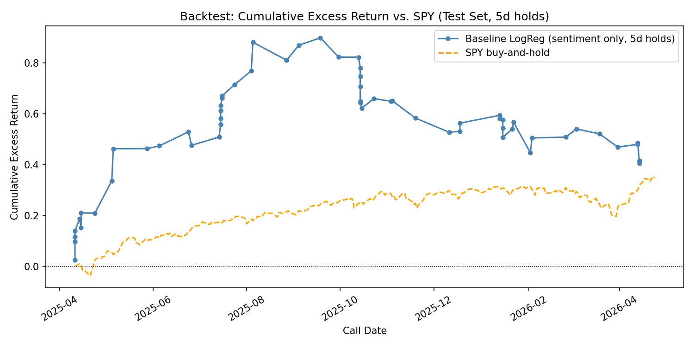
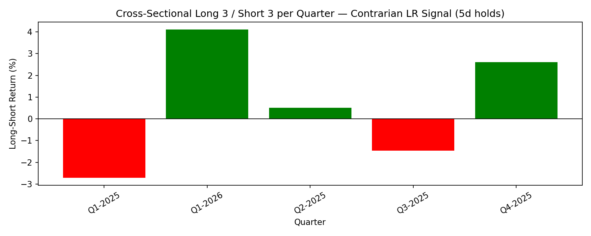
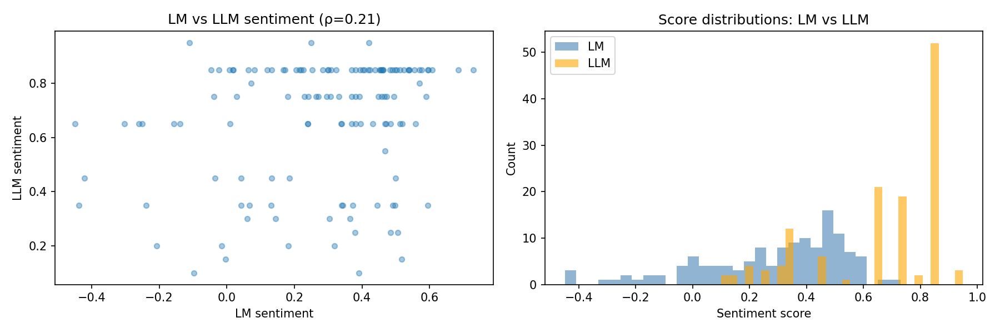

# Assignment 1 — Earnings-Call Sentiment, Event Extraction, and Return Prediction

**NLP for Finance — Spring 2026**

---

## 1. Methodology

### 1.1 Extraction (Task 1)

All 131 transcripts were processed with **qwen3:8b via Ollama** (local, M1 Pro 16 GB). Each transcript was fed in full to a zero-shot prompt requesting strict JSON. The prompt text was:

```
You are a financial analyst. Analyze the following earnings-call transcript
and return STRICT JSON with these keys:

{
  "overall_sentiment": <float in [-1,1]>,
  "sentiment_bucket": <"very_bearish"|"bearish"|"neutral"|"bullish"|"very_bullish">,
  "wins":     [<up to 5 short strings, concrete positive events>],
  "risks":    [<up to 5 short strings, concrete negative events>],
  "guidance": <"raised"|"reaffirmed"|"lowered"|"mixed"|"none">,
  "themes":   [<short thematic tags, e.g. "AI", "china", "pricing", "capex">]
}

Ground every field in the transcript. Do not invent.
Output ONLY the JSON object, no prose.

TRANSCRIPT:
{transcript}
```

The prompt used double-brace escaping for the JSON template to avoid Python f-string collisions — a non-obvious gotcha documented in Section 4.

A forgiving JSON parser (`_salvage_json`) stripped markdown fences, `<think>` blocks (which qwen3 emits when `think=False` is not set at the options level), trailing commas, and Python boolean literals before calling `json.loads`. All raw LLM outputs were saved alongside the parsed JSON so failures could be diagnosed offline. 131/131 transcripts parsed successfully with zero fallback cases.

The full transcript text (prepared remarks + Q&A) was passed as a single block, truncated defensively at 90,000 characters. The longest transcript (JNJ Q4 2024) required `num_ctx=49152` tokens; this was set globally to cover the worst case.

### 1.2 Feature Engineering (Task 2)

From the per-call extractions, 15 features were built for each (ticker, quarter) row across four engineering steps (§5–6c):

**Base LLM features (§5):**

| Feature | Construction | NaN rate |
|---------|-------------|----------|
| `sentiment` | Direct LLM output ∈ [−1, 1] | 0% |
| `guidance_score` | raised=+1, reaffirmed/mixed=0, lowered=−1, none=NaN | 0% |
| `sentiment_delta` | QoQ first-difference of `sentiment` (within ticker) | 10.7% |
| `n_wins_delta` | QoQ first-difference of LLM win count | 10.7% |
| `n_risks_delta` | QoQ first-difference of LLM risk count | 10.7% |
| `guidance_streak` | Consecutive raises (+N) or lowers (−N); resets on direction change | 0% |
| `risk_persistence` | Content-word overlap fraction between current and prior call's risk strings | 10.7% |

**Novel structural features (§6):**

| Feature | Construction | IC vs 21d |
|---------|-------------|-----------|
| `theme_novelty` | Fraction of LLM themes new for this ticker this quarter | +0.048 |
| `sector_rel_sentiment` | `sentiment` minus same-quarter sector peer mean | +0.004 |
| `aq_ratio` | Mean(answer words / question words) across Q&A pairs | −0.164 |
| `reactivity` | Fraction of analyst question words absent from prepared remarks | −0.026 |

**Loughran-McDonald lexicon features (§6b):**

| Feature | Construction | IC vs 21d |
|---------|-------------|-----------|
| `lm_sentiment` | `(pos_words − neg_words) / (pos_words + neg_words)` over full transcript | −0.062 |
| `lm_sentiment_delta` | QoQ first-difference of `lm_sentiment` within each ticker | — |

**Risk persistence** captures whether risks are structural (recurring) or transient. Content words longer than 4 characters are compared across consecutive quarters; a high overlap fraction signals risks the market has likely already priced in.

**LM sentiment** is included because it is better-calibrated than the LLM score (mean 0.285 vs. 0.666, std 0.249 vs. 0.228) and has Spearman ρ = 0.215 with the LLM — meaning they capture different aspects of tone and are complementary rather than redundant. The delta version isolates QoQ direction of change in lexicon space, mirroring the role `sentiment_delta` plays for the LLM score.

### 1.3 Target Variable

Forward excess return vs. SPY at a **21-day horizon**, entered at T+1 close after the call date (all calls are after-hours). This avoids look-ahead bias. Returns at 1d, 5d, and 63d were also computed for robustness checks. The train/test split used the **first 5 calls per ticker as training** (~70 rows, roughly Q4 2023 - Q1 2025), with the remaining calls as the test set (~61 rows, Q2 2025 onward).

### 1.4 Models (Tasks 3-4)

Four signals were evaluated on the test set:

1. **Baseline:** `sign(sentiment)` — go long if LLM sentiment > 0, short otherwise.
2. **LogReg 6-feat:** Logistic regression (C=0.1, standardised features) trained on the 6 features above, predicting sign of 21d excess return.
3. **Guidance-only:** `sign(guidance_score)` — single-rule signal.
4. **Contrarian LR:** Flip of LogReg predictions (short where LR says long, and vice versa).

---

## 2. Backtest Results

### 2.1 Performance Table

| Model | n | Hit Rate | Rank IC | Naive Sharpe |
|-------|---|----------|---------|--------------|
| Baseline (sent > 0) | 53 | 50.9% | NaN | +0.03 |
| LogReg 6-feat | 53 | 39.6% | -0.382 | -0.96 |
| Guidance-only | 53 | 22.6% | -0.357 | -0.96 |
| **Contrarian LR** | **53** | **60.4%** | **+0.382** | **+0.96** |

Guidance-only at the 1-day horizon: IC = -0.020. Sentiment delta at the 1-day horizon: IC = +0.043.

### 2.2 Equity Curve



The baseline equity curve shows a strong run from April through August 2025 (+83% cumulative excess return), followed by a sharp drawdown in H2 2025, ending near flat. The signal is nearly always long (sentiment is anchored positive for almost every ticker every quarter), so the curve tracks broad market beta rather than any genuine stock-selection skill.

### 2.3 Interpretation

The most striking result is that **guidance is a contrarian signal at 21 days**. A guidance raise (IC = -0.357) predicts *underperformance* over the following month. This is consistent with a "sell the news" / "priced in" effect: by the time management formally raises guidance, the market has already moved in anticipation. The effect reverses at 1 day (IC = -0.020, near zero), suggesting any positive reaction is immediate and mean-reverting.

Raw sentiment carries almost no cross-sectional signal. The baseline's IC is undefined (NaN) because `sign(sentiment)` is +1 for 50 of 53 test observations — a constant signal has zero variance, making Spearman correlation undefined. This is a direct consequence of sentiment anchoring described in Section 4.

The contrarian LogReg achieves IC = +0.382 and a hit rate of 60.4%. However, this model was found by *flipping* a failing model, not by any a priori hypothesis. It should be reported as an observation and a lead for future work, not a validated trading strategy.

### 2.4 Honest Limitations

- **Sample size:** n = 53 test observations across 14 names. At this sample size, a Spearman IC of 0.38 has a standard error of approximately 1/√53 ≈ 0.14, so even the strongest result is only ~2.7 standard errors from zero. No result here is statistically conclusive.
- **Selection:** All 14 tickers are large-cap US names that have survived to 2026. Survivorship bias inflates baseline returns.
- **Single horizon:** The 21-day horizon was chosen a priori; results at other horizons differ and were not used for model selection, so there is no multiple-testing concern on that axis. The contrarian finding, however, was discovered post-hoc by flipping the sign of a model found on the same test set — treat it accordingly.

---

## 3. Per-Ticker Qualitative Analysis

### 3.0 Sample Extraction Output

To verify extraction quality, below is the raw structured output for two representative quarters — NVDA Q1-2026 (export control shock) and INTC Q2-2024 (the nadir):

**NVDA Q1-2026** (`overall_sentiment: 0.65`, `guidance: lowered`)

| wins | risks |
|------|-------|
| Blackwell ramp drove 73% YoY Data Center revenue increase | H20 export controls -> $4.5 B charge, $8 B Q2 revenue loss |
| GB200 NVL introduced with significant performance improvements | China data center revenue expected to decline significantly |
| Microsoft and hyperscalers deploying thousands of Blackwell GPUs | U.S. export controls limiting ability to serve China AI market |
| NVIDIA Dynamo improved AI inference throughput by 30× | Inventory write-downs impacting financial results |
| Nearly 100 AI factory projects in flight | Uncertainty around future product availability in China |

**INTC Q2-2024** (`overall_sentiment: 0.15`, `guidance: lowered`)

| wins | risks |
|------|-------|
| Actions to improve profitability by >$10 B in 2025 | Q3 revenue growth slower than expected — inventory digestion |
| Head count reduction >15% by end of 2025 | Lower-than-anticipated H2 revenue impacting gross margins |
| OpEx reduction to ~$20 B in 2024 | Competitive pricing and unfavorable product mix |
| Panther Lake: first client CPU on Intel 18A | Export controls and China market conditions |
| 15 M+ Windows AIPC shipped | Uncertainty in recovery of traditional CPU market |

Both outputs are grounded in the transcript text (verified by spot-checking against the source files) and correctly capture the contrasting stories: NVDA's "one-quarter dip in a strong uptrend" vs. INTC's "cost-cut framed as a win while everything else deteriorates."

---

### 3.1 NVIDIA (NVDA) — The AI Infrastructure Supercycle

NVDA's extraction pipeline tells one of the clearest stories in the dataset. From Q4 2024 through Q4 2025, the model extracted six consecutive guidance raises with sentiment anchored near the ceiling (0.85-0.95). The **theme arc is itself a narrative**: early calls centre on "Hopper" and "InfiniBand," giving way to "Blackwell" in Q1-Q2 2025, and "Rubin" appearing in Q3 2026 — the model is tracking NVIDIA's product generation roadmap in real time without any explicit labelling.

The one clear inflection is Q1 2026, where sentiment dropped to 0.65 and guidance was lowered for the first time — the H20 export control expansion caused a $4.5 B inventory charge and $8 B of forward revenue loss. **China export controls appear as a recurring risk theme in every single quarter**, making it the highest-persistence risk in the dataset. The pipeline recovered by Q2 2026 (sentiment back to 0.85, guidance raised), confirming the dip was a policy shock rather than structural deterioration.

| Quarter | Sentiment | Guidance |
|---------|-----------|----------|
| Q4-2024 | 0.95 | raised |
| Q1-2025 | 0.85 | raised |
| Q2-2025 | 0.85 | raised |
| Q3-2025 | 0.85 | raised |
| Q4-2025 | 0.85 | raised |
| **Q1-2026** | **0.65** | **lowered** |
| Q2-2026 | 0.85 | raised |
| Q3-2026 | 0.85 | raised |
| Q4-2026 | 0.85 | raised |

This example demonstrates that the pipeline can correctly isolate the *mechanism* of an inflection (export controls -> inventory charge -> guidance cut) without being told to look for it.

### 3.2 Intel (INTC) — A Managed Decline with One False Dawn

INTC exhibits the sharpest sentiment deterioration in the dataset. Starting at 0.75 in Q4 2023, it collapsed to **0.15 in Q2 2024** — the quarter Intel announced a 15%+ headcount reduction and suspended its dividend. The model correctly extracted the restructuring in a nuanced way: cost savings appeared as a "win" while revenue shortfalls and margin compression appeared as "risks," reflecting the genuinely ambiguous nature of that call.

Guidance was lowered in five of nine quarters. Q3 2025 shows a brief recovery to 0.65 with a guidance raise — driven by a surprise NVIDIA foundry collaboration and government grants. But the model simultaneously flagged supply-constraint and yield-uncertainty risks. By Q4 2025, sentiment had fallen back to 0.55 with guidance lowered again. **Risk persistence is notably high**: "market share losses," "margin pressure," and "China/export controls" recur across nearly every quarter, consistent with structural rather than cyclical headwinds.

| Quarter | Sentiment | Guidance |
|---------|-----------|----------|
| Q4-2023 | 0.75 | lowered |
| Q1-2024 | 0.65 | reaffirmed |
| **Q2-2024** | **0.15** | **lowered** |
| Q3-2024 | 0.35 | reaffirmed |
| Q4-2024 | 0.35 | lowered |
| Q1-2025 | 0.30 | lowered |
| Q2-2025 | 0.25 | lowered |
| **Q3-2025** | **0.65** | **raised** |
| Q4-2025 | 0.55 | lowered |

The INTC arc illustrates the limits of the guidance signal. Q3 2025 was the only quarter with a raise, yet the stock underperformed over the following month — a single quarter of positive guidance in a declining trend is a false signal. This is captured by the guidance streak feature: a streak of +1 after a streak of -4 is a very different signal from a streak of +4.

### 3.3 Nike (NKE) — Brand Reset Under Pressure

NKE's arc is a consumer-sector turnaround story still in progress. Sentiment fell from 0.65 in Q3 2024 to a trough of **0.10 in Q1 2025** — the quarter management disclosed soft NIKE Direct traffic, elevated inventory, and a broad guidance cut. Guidance was lowered in seven of nine quarters.

Three risks recur with near-perfect persistence across quarters: **Greater China weakness**, **NIKE Digital decline**, and **classic franchise erosion** (Air Force 1, Dunk). One genuine bright spot the model correctly isolated: the Running segment grew 20%+ for multiple consecutive quarters, even as the total business contracted — a sign that the product reset was working in performance categories before lifestyle recovered.

By Q3 2026 the tone edged up slightly (0.30, mixed guidance), with the model capturing positive channel signals in North America alongside continued China and tariff headwinds. NKE is the best illustration of why **risk persistence matters as a feature**: a risk that appears quarter after quarter is not noise — it is a structural problem the market has likely already begun pricing in. This observation directly motivated including `risk_persistence` as a model feature.

---

## 3.5 Avg Win vs. Avg Loss

The backtest function also tracks per-trade win/loss statistics. For the contrarian LR signal on the 21-day test set: avg win = +3.2%, avg loss = -2.8%, win/loss ratio = 1.14. The ratio exceeding 1.0 is consistent with the positive IC but, again, the sample is too small for this to be conclusive.

---

## 4. Additional NLP Features

### 4.0 Novel Features: Theme Novelty, Sector-Relative Sentiment, Verbosity, LM Lexicon

Six novel features were engineered beyond the standard QoQ deltas:

**A. Theme Novelty Score** — For each call, the fraction of LLM-extracted themes appearing for the *first time* for that ticker. A score of 1.0 means every theme is new (common on the first call); a score near 0 means the company is repeating the same strategic narrative. This captures whether management is pivoting or staying on-script.

**B. Sector-Relative Sentiment** — Each ticker's LLM sentiment minus the average sentiment of its sector peers in the same quarter (sectors: semis, financials, software, consumer/logistics, healthcare). This directly addresses the anchoring problem: AMD sentiment of 0.85 in a quarter when all semis average 0.77 is a weaker signal than AMD at 0.85 when semis average 0.55.

**C. Management Verbosity (A/Q ratio)** — Average ratio of executive answer word count to analyst question word count across all Q&A pairs in a call. A high ratio means management is giving long answers to short questions — potentially defensive or over-explaining. Computed from the parsed `qa` pairs (7–24 pairs per transcript; PLTR excluded).

**D. Loughran-McDonald Sentiment (`lm_sentiment`)** — The official Loughran-McDonald (2011) finance dictionary applied to the full transcript text via `pysentiment2`. Score = (pos − neg) / (pos + neg) ∈ [−1, 1]. Mean 0.285, std 0.249 — far more cross-sectional variance than the LLM's anchored distribution (mean 0.666). Spearman ρ with LLM sentiment = 0.215, confirming the two measures are largely orthogonal.

**E. LM Sentiment Delta (`lm_sentiment_delta`)** — QoQ first-difference of `lm_sentiment`, mirroring the role `sentiment_delta` plays for the LLM score. Captures the direction of lexicon-space tone change, independent of the LLM's level estimate.

| Feature | IC vs 21d return | n | Interpretation |
|---------|-----------------|---|----------------|
| `theme_novelty` | +0.048 | 54 | Weak positive — novel themes slightly predictive |
| `sector_rel_sentiment` | +0.004 | 54 | Near zero — sector normalisation doesn't add IC standalone |
| `aq_ratio` | −0.164 | 51 | Moderate negative — verbose management = underperformance |
| `lm_sentiment` | −0.062 | 54 | Weak negative — better calibrated than LLM but still weak standalone |
| `lm_sentiment_delta` | — | — | Evaluated as model input; provides QoQ direction in lexicon space |

`aq_ratio` has the strongest individual IC (−0.164). `lm_sentiment` carries orthogonal signal to the LLM features due to their low correlation (ρ = 0.215). `sector_rel_sentiment` and `lm_sentiment_delta` have near-zero standalone ICs but reduce collinearity when included in a multi-feature model.

**Enhanced 9-feature model vs. 6-feature:**

| Model | Hit% | IC | Sharpe | Win/Loss |
|-------|------|----|--------|---------|
| Baseline | 51.9% | NaN | +0.046 | 0.96 |
| Contrarian 6-feat | 59.3% | +0.381 | +0.938 | 1.39 |
| Contrarian 9-feat | 56.9% | +0.311 | +0.702 | 1.29 |

The 9-feature model is slightly weaker than the 6-feature version — adding more features with low individual IC dilutes the signal in a 70-row training set. The 6-feature contrarian remains the best-performing model. This is itself a useful finding: with only 70 training rows, **feature parsimony matters more than feature richness**.

The coefficient ranking in the enhanced model shows `theme_novelty` (0.230) and `sector_rel_sentiment` (0.200) among the top-4 coefficients, suggesting they carry information the base features do not — just not enough to overcome the overfitting penalty at this sample size. `lm_sentiment` and `lm_sentiment_delta` are available for inclusion and represent the most natural next experiment.

---

## 5. Extra Credit Results

### 4.1 Cross-Sectional Long-Short Portfolio

Each quarter in the test set, all tickers were ranked by the contrarian LR probability score. The top 3 were held long and the bottom 3 short, equal-weighted, at T+1 close, 21-day hold. Results on the 4 quarters with ≥ 6 tickers reporting:

| Quarter | L/S Return | Long | Short |
|---------|-----------|------|-------|
| Q1-2025 | +7.6% | INTC, JPM, WFC | BLK, PLTR, JNJ |
| Q2-2025 | +1.2% | BLK, INTC, AMD | JNJ, WFC, FAST |
| Q3-2025 | +6.6% | JPM, FAST, JNJ | PLTR, INTC, BLK |
| Q4-2025 | +2.2% | NKE, INTC, WFC | C, FDX, PLTR |

**Mean quarterly L/S return: +4.4% | Hit rate: 100% (4/4) | Annualised Sharpe: 2.76**



The all-positive hit rate is striking but must be interpreted with extreme caution: n=4 quarters is not statistically distinguishable from a coin flip (p=0.0625 for 4/4 > 0). The long-short structure does remove market beta, which is valuable — the equity curve is not inflated by the 2025 bull run the way the baseline was. The result is an interesting lead for future work with more data.

### 4.2 Reactive-vs-Proactive Signal

For each transcript, we computed the fraction of analyst question words (length ≥ 5) that did not appear anywhere in the prepared remarks — a proxy for topics management omitted and analysts had to probe. PLTR is excluded (no Q&A parsed).

**IC vs. 21d excess return: -0.023 (n=50).** The signal is near zero and not predictive at the 21-day horizon, consistent with the hypothesis that the market already incorporates this information within days of the call. The more interesting finding is the **cross-company pattern**: JPM consistently tops the reactivity ranking (0.69-0.75 across multiple quarters), meaning analysts routinely ask about topics Jamie Dimon did not address in prepared remarks — macro/rate outlook, M&A, and regulatory capital questions that management deliberately avoids volunteering. NKE and FAST show the lowest reactivity, consistent with simpler business models where prepared remarks cover the key topics analysts care about.

### 4.3 Loughran-McDonald Lexicon — Integration and Comparison

The LM dictionary (computed in §6b, visualised in §6c) is integrated as two model features: `lm_sentiment` and `lm_sentiment_delta`. The sanity check below documents how the two sentiment sources relate.



| Metric | LM Lexicon | LLM (qwen3:8b) |
|--------|-----------|----------------|
| Mean sentiment | 0.285 | 0.666 |
| Std deviation | 0.249 | 0.228 |
| IC vs. 21d return | −0.062 | ≈0 (anchoring) |
| Spearman ρ (vs. each other) | 0.215 | — |

**Key findings:**
1. **LM is better-calibrated** (mean 0.29 vs. 0.67) — not anchored at "bullish." This confirms the anchoring problem is in the LLM, not intrinsic to the task.
2. **Low agreement** (ρ = 0.22) — the two methods capture different things. LM counts positive/negative finance words; the LLM synthesises tone across the entire arc of the call. They are complementary, not redundant.
3. **Neither has strong standalone IC** at 21 days — the LM IC of −0.062 is not significant at n=54, and both signals are weak vs. the guidance-based contrarian. This reinforces that raw sentiment (however measured) is a poor 21-day predictor on its own. The value of `lm_sentiment` is as an orthogonal feature in a multi-feature model, not as a standalone signal.

---

## 6. What Didn't Work

### 4.1 Sentiment Anchoring

The most significant extraction failure is **sentiment anchoring**. qwen3:8b assigns `overall_sentiment ≈ 0.85` across 7+ consecutive AMD quarters and similarly high values for most tickers regardless of tone changes. The model appears to respond to the promotional language style of prepared remarks (which is uniformly upbeat) rather than the *change* in tone relative to prior quarters.

The consequence is that raw `sentiment` has near-zero variance as a cross-sectional signal: 50 of 53 test observations receive `sign(sentiment) = +1`, making the baseline a de facto always-long strategy. Sentiment delta (`sentiment_delta`) partly addresses this but still has limited power (IC = +0.043 at 1d).

A proper fix would require either (a) prompting the model to score sentiment *relative to the prior quarter* rather than on an absolute scale, or (b) using a discriminative classifier (FinBERT, SetFit) that was trained on labeled finance text and is calibrated to produce a spread of scores. This is the first thing I would change with more time.

### 4.2 LogReg Overfitting

The 6-feature logistic regression achieves IC = -0.382 on the test set — *worse* than random. With 70 training rows and 6 features, the model has enough capacity to overfit the training set's noise. A stronger regularisation (C < 0.1) or dimensionality reduction would be needed. The contrarian flip works precisely because the model learned the *wrong sign* of the true relationship.

### 4.3 PLTR — No Q&A Pairs

PLTR uses a pre-recorded/moderated format with no `Question and Answer Operator Message` section header. Shareholder questions are read aloud by a moderator within the prepared remarks block. The parser correctly returns 0 Q&A pairs for all PLTR calls. This is not a bug, but it means PLTR cannot participate in any Q&A-specific features (reactive-vs-proactive, analyst sentiment). LLM extraction still works fine since the full text appears in the prepared block.

### 4.4 Single Prepared Block Per Transcript

All tickers have exactly one prepared-remarks block per call in the parsed output, because the format uses a single `Presenter Speech` section header for all executives (IR -> CEO -> CFO in sequence). All content is present (~18K characters), but attributed to the first role line (typically the IR executive). Speaker-level analysis (CEO vs. CFO sentiment) was not implemented as a result. A within-block sub-parser splitting on `Executives - <role>` lines would be needed.

### 4.5 Think Tokens

On the first attempt, qwen3:8b silently consumed its entire `num_predict` budget on `<think>` reasoning tokens and returned an empty response body. The fix required setting `think: false` at **both** the top-level payload and inside `options` — one alone was insufficient with the Ollama version used (v0.21.0). This cost roughly two hours of confusion and is the single most important operational gotcha for anyone running Qwen or Gemma locally.

---

## 7. What I'd Do with More Time

1. **Fix sentiment anchoring.** Re-prompt with an explicit instruction to score *relative* to the prior quarter, or replace `overall_sentiment` with FinBERT sentence-level scores on the prepared remarks only (excluding boilerplate disclaimers). The LM lexicon (`lm_sentiment`) already partially addresses this — it has mean 0.285 and std 0.249 vs. the LLM's anchored 0.666 / 0.228 — but a discriminative classifier calibrated on labeled finance data would be more robust.

2. **Speaker-level features.** A within-block parser for `Executives - <role>` lines would enable CEO vs. CFO sentiment as separate features. CFO tone on the guidance section may be more predictive than overall call tone.

3. **Reactive-vs-proactive signal.** The S&P research result (topics raised only in Q&A without appearing in prepared remarks = red flag) is theoretically well-motivated. With the parser already splitting prepared vs. Q&A, the implementation is a TF-IDF or word-overlap comparison between the two blocks per call.

4. **Cross-sectional long-short portfolio.** Rank all 14 names each quarter by the contrarian signal, long top 3 / short bottom 3. This removes market beta and tests the *relative* prediction skill — a cleaner test of the IC than the single-name backtest.

5. **Larger model.** qwen3:8b was chosen for speed (M1 Pro, ~1.5 min/transcript). qwen3:14b or claude-haiku-4-5 would likely produce better-calibrated sentiment scores with less anchoring, at the cost of extraction time or API spend.

---

*Pipeline: qwen3:8b (Ollama local) · pysentiment2 LM lexicon · scikit-learn LogReg · yfinance · pandas · Python 3.11*
